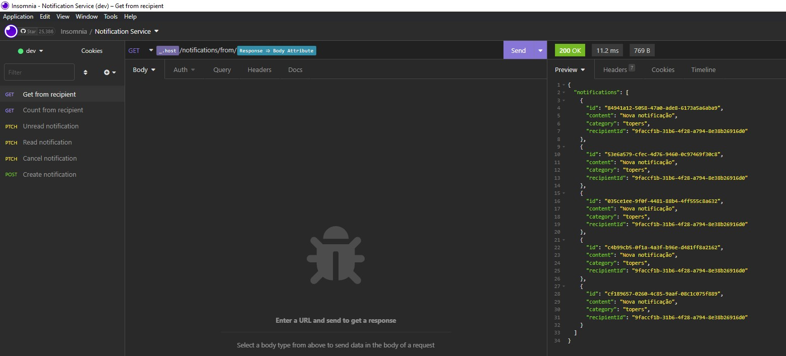
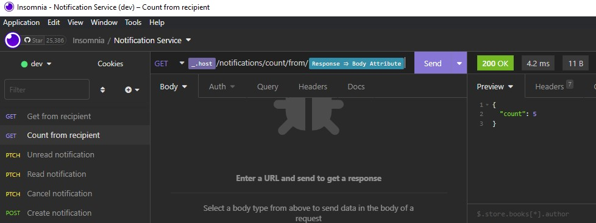
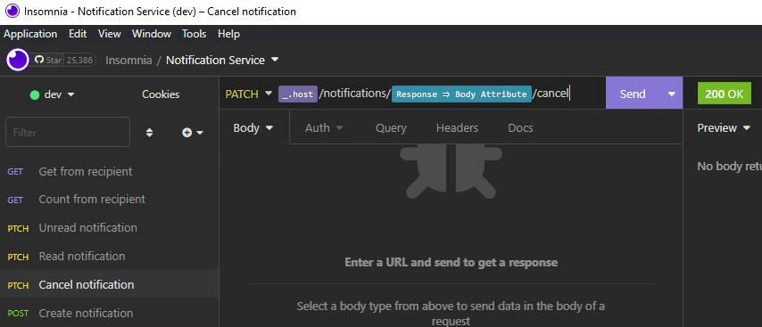
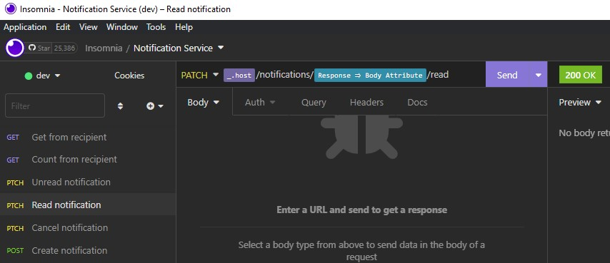
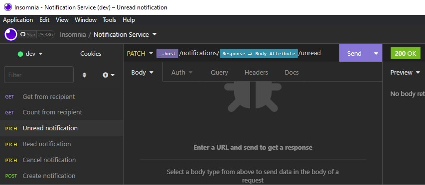
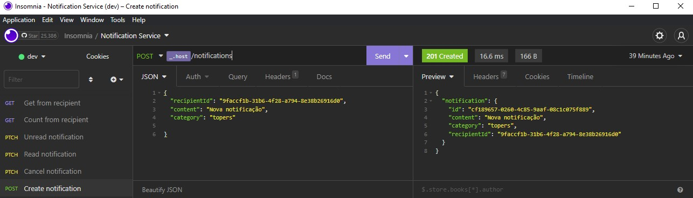

<h1 align="center"> Ignite Node.js - Notification Back-End </h1>

<p align="center">
    Node.js week to learn more about the concepts and workings.
</p>

<p align="center">
  <a href="#-technologies">Technologies</a>&nbsp;&nbsp;&nbsp;|&nbsp;&nbsp;&nbsp;
  <a href="#-project">Project</a>&nbsp;&nbsp;&nbsp;|&nbsp;&nbsp;&nbsp;
  <a href="#-references">References</a>&nbsp;&nbsp;&nbsp;|&nbsp;&nbsp;&nbsp;
  <a href="#memo-licence">Licence</a>
</p>

<p align="center">
  
</p>

<br>

## Result

<p align="center">
    
</p>

## Tkinter

<p align="center">
    
    
</p>
<p align="center">
    
    
    
</p>

## 🚀 Technologies

This project was developed with the following technologies:

- [Nest](https://github.com/nestjs/nest) framework TypeScript starter repository.
- [Typescript](https://www.typescriptlang.org/)
- [Prisma](https://www.prisma.io/)

## 💻 Project

Project with the pandas library, allowing more knowledge about this tool

## Installation

```bash
$ npm install
```

## Running the app

```bash
# development
$ npm run start

# watch mode
$ npm run start:dev

# production mode
$ npm run start:prod
```

## Test

```bash
# unit tests
$ npm run test

# e2e tests
$ npm run test:e2e

# test coverage
$ npm run test:cov
```

Microserviços - Utilizam um banco de dados. Uma aplicação onde as suas funcionalidades são separadas em projetos menores que, apesar de interligados, são independentes.
Dentro da pasta src, o NestJS possui três tipos de arquivos principais: Modules, controllers e services.
```bash
$ npm i -g@nestjs/cli
$ nest new folder_name
$ npm run start:dev
```
http://localhost:3000/
dist/ - conversor ts para js, node apenas entende js
node_modules/ - dependências
ctrl+shift+p >preferences: Open User Settings
app.controller.ts - rotas para a plicação
app.service.ts - funcionalidades gerais
Extensão Prisma
```bash
$ npm i prisma -D
$ npm i @prisma/client
$ npx prisma init --datasource-provider SQLite
$ npx prisma migrate dev
$ npx prisma studio
$ npm i class-validator class-transformer
```
lá em baixo, no CRLF, muda para LF
Importância de fazer Design Software antes de entrar com a programação.
Geralmente inicia criando um banco de dados.
infra/ tudo que se é externo da aplicação, banco de dados, API, http
undefined: valor sem nada (sem existencia)
null: valor vazio (com existêcia)
tsconfig.json
	"strict": true,
	"strictNullChecks": true,
	"strictPropertyInitialization": false,
jest.config.ts - jest of package.json
npm run test
repositories/ intermediario de comunicação de banco e app
DTO - Data Transfer Object
ctrl+shift+p >TypeScript: Restart TS Server

- Para adicionarmos uma camada de proteção no gerenciamento dos nossos dados, utilizaremos getters e setters na nossa classe Notification. Como eles ajudam nessa proteção?
Os getters e setters permitem que a gente busque e configure dados por meio de métodos definidos, podendo assim aplicar validações e outras proteções em vez de simplesmente aceitar os valores repassados.
- O que é o conceito Value Object?
Uma forma de agregar validações e outras funcionalidades no momento da definição de um campo.
- Qual a vantagem de utilizar in-memory database?
Trabalhar com os dados no mesmo padrão e formato do banco de dados em produção, porém mantendo os dados apenas em memória. Assim, evita a dependência de terceiros nos testes (banco de dados) e também do uso de mocks.
- O que é Mapper? Mapeamento de dados a partir de uma conversão na forma de acesso a esses dados para um formato conhecido pelo alvo.

NESTJS
- Extension to run in VSCode: ESLint and Prisma

Links Usefull:
<p align="left"> VSCode Download -  https://code.visualstudio.com/download</p>
<p align="left"> Git Download -  https://git-scm.com/download/win</p>

## 🔖 References

Microservices Guide
https://martinfowler.com/microservices/

Plataforma Rocketseat
https://app.rocketseat.com.br/

## :memo: Licence

This project is under the MIT license.

---

Made with ♥ by Karoline :wave: [Let's program together!](https://www.linkedin.com/in/karoline-hikari-yamamoto/)
